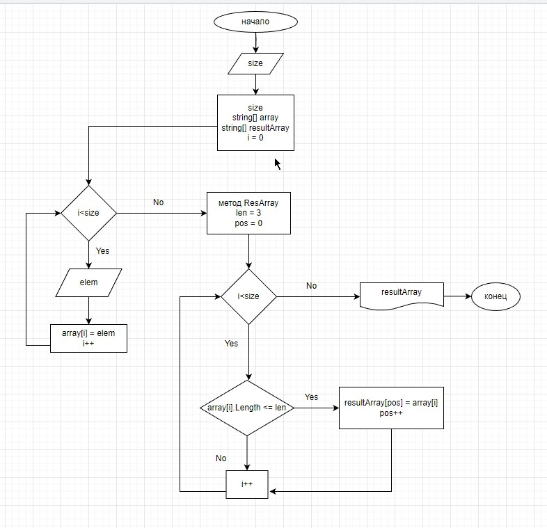

1. Запрос у польщователя размер массива. 
2. Создание переменной, хранящей размер массива. 
3. Создание массива (пока заполненого 0).
4. Создание результирующего массива.
5. Запрос у пользователя самих элементов.
6. Заполнение созданного массива элементами, введенных пользователем.
7. Создание переменной, в которой указан ограничитель на кол-во символов.
8. Создание переменной, указывающей на позицию элемента в новом списке.
6. Проверка каждого элемента на количество символов.
7. Заполнение нового массива элементами, проходящими по заданию.
8. Вывод первого и финального массивов. 

